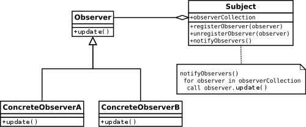

# Strategy Pattern

## Problem

## Solution

## Example

## Resources

* [Observer Pattern – Design Patterns (ep 2)](https://www.youtube.com/watch?v=_BpmfnqjgzQ)
* [IObservable<T>(IObserver<T>) @ Microsoft Docs ](https://docs.microsoft.com/en-us/dotnet/api/system.iobservable-1?redirectedfrom=MSDN&view=netframework-4.7.2)

### C++ Implementation

1: Creating subject...
2: Notifying all registered observers...
3: Creating observer Bosse...
4: Registering Bosse at Subject...
5: Notifying all registered observers...
- Bosse was notified and updated.
6: Creating observer Kjelle...
7: Registering Kjelle at Subject...
8: Creating observer Ronny...
9: Registering Ronny at Subject...
10: Notifying all registered observers...
- Bosse was notified and updated.
- Kjelle was notified and updated.
- Ronny was notified and updated.
11: Unregistering all observers...
12: Notifying all registered observers...
